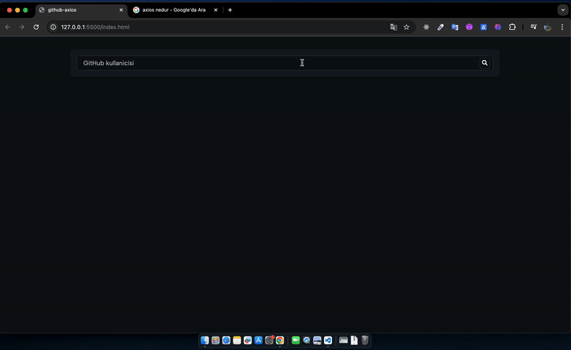

# 💻 GitHub Profile Viewer

## 📋 **Project Overview**
GitHub Profile Viewer is a user-friendly web application that allows users to search for GitHub usernames and view their profiles in a card format. The application displays the user's profile information along with up to 3 of their repositories, which are accessible via clickable links. This project is built using HTML, CSS, and JavaScript, with data being fetched using the Axios library.

## 🌟 **Key Features**
- **Search Functionality**: Users can enter a GitHub username to search for a profile.
- **Profile Display**: The selected user's profile is displayed in a card format, including their profile information.
- **Repository Links**: Up to 3 repositories of the user are shown, and users can click to access them.
- **Responsive Design**: Optimized for excellent performance on all devices.
- **User-Friendly Interface**: Simple and easy-to-use design.

## 💻 **Technologies Used**
- **HTML5**: For creating the structure of the web page.
- **CSS3**: For visual design and styling.
- **JavaScript**: For dynamic content and functionality.
- **Axios**: For fetching data from the GitHub API.

### 💻 **Usage**
- **Search for a Profile**: Enter a GitHub username in the search bar and select the user.
- **View Profile Information**: The user's profile information is displayed in a card format.
- **Access Repositories**: Click on the repository links to access up to 3 repositories of the user.

## 🔧 **Features and Tips**
- **Search Input**: Use the search bar to enter the GitHub username you want to find.
- **Profile Card**: The selected user's profile information is displayed in an aesthetically pleasing card format.
- **Repository Links**: Directly access the repositories of the user by clicking the links provided.
- **Responsive Design**: Ensure the application works seamlessly on all devices.

## 🤝 **Contributing**
To contribute to this project, please open an issue first. Fork the repository, make your changes, and submit a pull request.

## 🌍 **Demo**

---

